# ORA Discord Bot - Ultimate Edition 🌌
### *The Self-Healing, Hybrid AI Operating System*

<div align="center">


[](https://discord.gg/YoneRai12)
[](https://www.python.org/)
[](src/config.py)
[](https://www.nvidia.com/)

[](README.md)
[](README_JP.md)

</div>

---

## 🚀 Overview (Code-Accurate)
ORA is not just a chatbot. It is a **Hybrid AI Operating System** that fuses the raw power of your **RTX 5090 (Local)** with the logic of **GPT-5.1 (Cloud)**. It features a biological "Auto-Healer" that repairs its own code at runtime.

### 🧠 Hybrid Brain Architecture (Configured)
The system automatically routes requests based on complexity (`src/config.py`).

| Layer | Model | Role |
| :--- | :--- | :--- |
| **Logic Core (L2)** | **Qwen 2.5-VL 32B** | The primary local brain. Handles Vision, RAG, and general chat. **Free & Private**. |
| **Vision (Native)** | **Qwen 2.5-VL** | Reads screens/images natively without external APIs. |
| **Cloud Genius (L3)** | **GPT-5.1 / Codex** | Called ONLY for complex coding tasks or massive logical reasoning. |
| **Voice Engine** | **T5Gemma-TTS** | Runs on Port 8002. Provides real-time voice cloning. |

---

## 🧬 Biological Features

### 1. Auto-Healer (Self-Repair)
ORA listens to her own stack traces. When a crash occurs:
1.  **Intercept**: Captures the traceback (`healer.py`).
2.  **Diagnose**: Uses GPT-5 Codex to analyze the root cause.
3.  **Patch**: Rewrites the broken function in `src/`.
4.  **Hot-Reload**: Reloads the Cog instantly without restarting the process.

### 2. NERV-Style Dashboard
A React/Next.js interface (`ora-ui/`) that visualizes the bot's "Thought Process".
*   **Red Alert Mode**: If Admin Override is triggered, the entire UI shifts to a Hex-Grid Emergency state.
*   **Live Stream**: Real-time log streaming via WebSocket.

### 3. Gaming Optimization
Automatically detects high-load processes (`config.py`):
*   **Targets**: `valorant.exe`, `ffxiv_dx11.exe`, `javaw.exe` (Minecraft).
*   **Action**: Dynamically unloads the 32B model and switches to a 7B "Gaming Brain" to free up VRAM for FPS.

---

## 🏗️ Logic Flow (v4.2)

```mermaid
graph TD
    Input[Input Request] --> Router{Smart Router}
    
    %% Local Path (Default)
    Router -->|Privacy / Speed| Local[🏠 Local Brain]
    Local --> Qwen["Qwen 2.5 VL (32B)"]
    
    %% Cloud Path (Complex)
    Router -->|Coding / Logic| Cloud[☁️ Cloud Brain]
    Cloud --> GPT["GPT-5.1-Codex"]
    Cloud --> Gemini["Gemini 2.0 Flash"]

    %% Tools
    Local --> Tools[🛠️ Tools]
    Cloud --> Tools
    
    Tools --> Image["🎨 Flux.1 Generate"]
    Tools --> System["� PC Control (Win/Mac)"]
    Tools --> Healer["🧬 Auto-Healer"]

    %% Output
    Tools --> Response
    GPT --> Response
    Qwen --> Response["Final Response"]
    
    style Router fill:#ff0055,stroke:#fff,stroke-width:2px
    style Local fill:#00aaff,stroke:#fff
    style Cloud fill:#aa00ff,stroke:#fff
    style Response fill:#00ff00,stroke:#000
```



---

## 💻 Installation & Usage

### 1. Environment Setup
Rename `.env.example` to `.env`. **You MUST set `ADMIN_USER_ID`** for the Self-Evolution system to work.

```ini
DISCORD_BOT_TOKEN=your_token
ADMIN_USER_ID=1234567890
LLM_MODEL=Qwen/Qwen2.5-VL-32B-Instruct-AWQ
```

### 2. Launch
*   **Windows**: Right-click Desktop -> `Start ORA Bot`.
*   **Mac**: Run `Double_Click_To_Start.command`.

---

## 📚 Update History
For detailed version history (v3.9 - v4.1), please see [CHANGELOG.md](CHANGELOG.md).

<div align="center">

**Developed by YoneRai12**
*Powered by the Bleeding Edge of AI*

</div>
