# ORA (v5.0-Singularity) 🌌
### **The Artificial Lifeform AI System for High-End PC**

[**[📖 Manual]**](docs/USER_GUIDE.md) | [**[📂 Releases]**](https://github.com/YoneRai12/ORA/releases) | [**[🌐 Dashboard]**](http://localhost:3000)

---

[**English**](README.md) | [日本語](README_JP.md)

---

## 📖 What is ORA?

ORA is no longer just a "Bot". It is a **Living AI Operating System** that inhabits your high-end PC.
Designed to push the **RTX 5090** to its limits, she combines self-healing code, autonomous evolution, and multimodal vision into a single, seamless personal AI experience.

### 🚀 Key Features

*   **⚡ Hybrid Intelligence**: Intelligent routing between **Qwen 2.5-VL** (Fast Local) and **GPT-5.1** (Deep Cloud Reasoning).
*   **🧬 Auto-Healer**: When ORA encounters an error, she writes her own Python patch and hot-reloads herself.
*   **👁️ True Vision**: Real-time desktop/gameplay analysis via advanced Vision Transformers.
*   **🔒 Privacy First**: Your data stays on your machine. PII is handled exclusively by local models.

### 📊 Module Readiness Status

| Category | Component | Status | Description |
| :--- | :--- | :--- | :--- |
| **Thinking** | Omni-Router (Intent) | ✅ Stable | Context-aware brain routing |
| **Visual** | Vision / OCR | ✅ Stable | Real-time screen capture & analysis |
| **System** | Auto-Healer | 🛠️ In-Dev | Self-repair & GitHub sync logic |
| **Media** | Image Gen / Video | ✅ Stable | Local FLUX.2 / yt-dlp integration |
| **Platform** | Windows / Mac / Web | ✅ Active | Multi-frontend ecosystem support |

---

## 🔥 The "Big Three" Core Pillars

### 1. 🧬 Immortal Code (Self-Healing)
**"I fell down, but I fixed my leg and stood up. I am stronger now."**

Most software crashes when it hits a bug. ORA treats bugs as **learning opportunities**.
When a runtime error occurs (e.g., specific API failure), ORA:
1.  **Freezes** the crash state.
2.  **Analyzes** the traceback with her Logic Brain (GPT-5/4o).
3.  **Writes a Patch**: She edits her own `.py` source code locally.
4.  **Hot-Reloads**: She restarts *only* the broken component (Cog) without disconnecting from Voice.

> *Result: You can leave ORA running for months, and she will theoretically become more stable over time.*

### 2. 🏠 Omni-Router (Hybrid Intelligence)
**"Why pay for OpenAI when you have an RTX 5090?"**

### 🔄 Hybrid Agentic Flow
ORA is a **Hybrid Agent** that intelligently balances your local hardware power (Local) with world-class cloud intelligence (Cloud API).

```mermaid
graph TD
    %% Styling
    classDef frontend fill:#f3e5f5,stroke:#9c27b0,stroke-width:2px,color:#000
    classDef router fill:#e1f5fe,stroke:#039be5,stroke-width:2px,color:#000
    classDef cloud fill:#e8f5e9,stroke:#4caf50,stroke-width:2px,color:#000
    classDef local fill:#212121,stroke:#90a4ae,stroke-width:2px,color:#fff
    classDef tool fill:#fff3e0,stroke:#fb8c00,stroke-width:2px,color:#000
    classDef final fill:#fce4ec,stroke:#f06292,stroke-width:2px,color:#000

    subgraph Frontends ["🌐 Multi-Environment"]
        Discord([💬 Discord Bot]):::frontend
        WebDash([🖥️ Web Dashboard]):::frontend
        Mobile([📱 Mobile / API]):::frontend
    end

    Frontends --> Router{🧠 Omni-Router}:::router
    
    subgraph Thinking ["💎 Hybrid Thinking (Hybrid Brain)"]
        Router -->|Privacy / Low Cost| Local[🏠 Local PC / Home Hardware]:::local
        Router -->|Deep Reasoning / Code| Cloud[☁️ Cloud API / GPT-5.1]:::cloud
        
        Local -->|Fast Inference| Brain[🧠 ORA Core Logic]
        Cloud -->|High Intel| Brain
    end

    subgraph Execution ["⚡ Execution Layer (Action)"]
        Brain --> Tools{🧰 Tools}:::tool
        
        Tools --> Web[🔍 Search/Save]:::tool
        Tools --> Vision[👁️ Vision/Screen]:::tool
        Tools --> Code[💻 Code Execution]:::tool
        Tools --> Media[🎨 Image/Voice]:::tool
    end

    Tools --> Memory[(💾 Memory / RAG)]
    Memory --> Output([✨ Final Reply]):::final
    
    Output -.->|Real-time Notify| Frontends
```

*   **Smart Routing**: She analyzes prompt length and keywords (e.g., "fix code" -> Codex).
*   **Cost Control**: Falls back to Local LLM if quotas are exceeded.
*   **Universal Connection**: Automatically routes `gpt-*` models to OpenAI Cloud and others to Local VLLM.

### 📡 Policy Router Rules (Decision Logic)
ORA is not a black box. Routing follows strict policies to ensure safety and efficiency:

1.  **🛡️ Privacy Guard**: If PII (Phone #, Address, etc.) is detected, ORA **Force-Switches to Local Mode** to prevent data leak.
2.  **⚡ Budget Guard**: If GPU VRAM usage exceeds **25GB**, Cloud API usage is throttled, and lightweight Local models (7B) are prioritized.
3.  **💻 Coding Priority**: Prompts with code blocks or error stack traces are routed to **GPT-5.1-Codex**.
4.  **👁️ Vision Handling**: Images are automatically routed to **GPT-5-Vision** (Cloud) or **Qwen-VL** (Local).

### ⚡ Resource Manager (VRAM Modes)
Standard AI slows down your PC. ORA "co-exists" with your workflow.

*   **Normal Mode (Cap: 25GB)**: Quality First. Uses Deep Thinking models and Qwen-32B for best answers.
*   **Gaming Mode (Cap: 18GB)**: Detects games (e.g., `valorant.exe`) and swaps to lightweight models to ensure **0 FPS drop**.
*   **Safety Mode (Cloud Block)**: Offline-only mode for high-security environments.

### 3. 👥 Shadow Clone (Zero Downtime)
Updates usually mean "Downtime". Not for ORA.
When ORA needs to restart (for an update or self-healing), she spawning a **"Shadow Clone"** (Watcher Process).
*   The Shadow keeps the Voice Connection alive.
*   The Main Body dies, updates, and reborns.
*   **Crash Safety**: If the Shadow detects configuration errors (missing tokens), it forcefully kills itself to prevent zombie processes.

---

## 👁️ True Multimodal I/O (The "Senses")

ORA processes the world through **Images**, **Sound**, and **Text**.

### 1. Vision (The Eyes) 🖼️
ORA uses **Qwen 2.5-VL (Visual Language Model)** or **GPT-5-Vision** to "see" images.
*   **Screenshot Analysis**: Share a screenshot of your game or code, and she understands it.

### 2. Audio (The Ears & Voice) 🎤
*   **Multi-User Recognition**: ORA distinguishes *who* is speaking within 0.2s.
*   **Dynamic Tone**: Through prompt engineering, she acts as distinct personas (e.g., Tsundere, Maid) that you configure.

### 3. Generation (The Hands) 🎨
ORA creates content locally.
*   **Image Generation**: Uses **FLUX.2** or **Stable Diffusion XL** locally.

---

## 🛡️ NERV User Interface
A dedicated Web Dashboard (`http://localhost:3000`) for monitoring ORA's brain.
*   **Hex-Grid Visualizer**: See the status of every module.
*   **Memory Explorer**: View what ORA remembers about you.
*   **Process Killer**: One-click "Gaming Mode" to kill background bloatware and free up VRAM.

---

## ⚙️ Configuration Bible (.env)

| Variable | Description |
| :--- | :--- |
| `DISCORD_BOT_TOKEN` | **Required**. Your Bot Token. |
| `ADMIN_USER_ID` | **Required**. Your Discord User ID. |
| `OPENAI_API_KEY` | Optional. Required if using `gpt-*` models. |
| `LLM_BASE_URL` | Endpoint for Local LLM (Default: `http://localhost:8001/v1`). |
| `GAMING_PROCESSES` | Process names that trigger Gaming Mode (Low VRAM usage). |

---

## 🤝 Contributing
1.  **Fork** the repository.
2.  **Create** a feature branch.
3.  **Commit** your changes.
4.  **Open a PR**.

**Rules:**
*   No hardcoded API keys.
*   Run `tools/debug/check_transformers.py` before submitting.

---

## 📜 License
Project ORA is licensed under **MIT License**.
You own your data. You own your intelligence.

**Architected by YoneRai12**
*A project to blur the line between Software and Life.*

